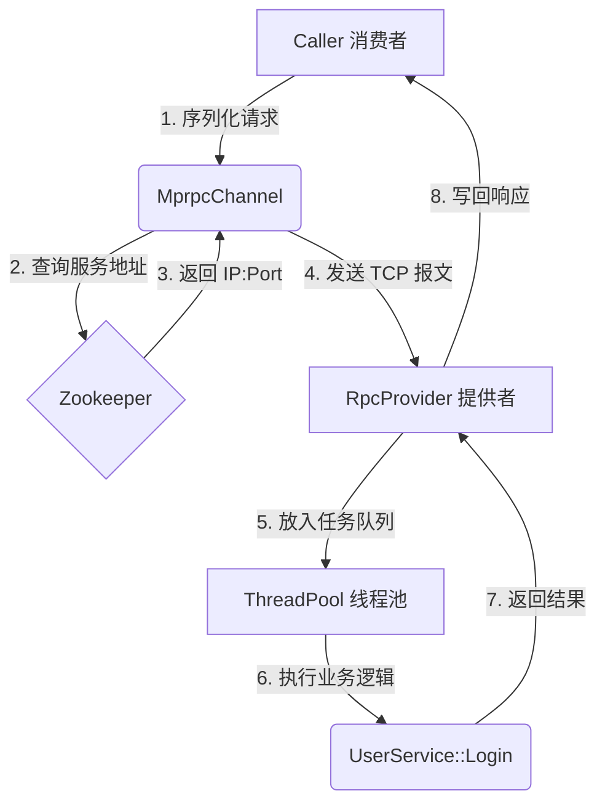

# Mprpc: 基于 Muduo 与 Protobuf 的高性能分布式 RPC 框架

Mprpc 是一个高性能的 C++ 分布式远程过程调用（RPC）框架。它通过解耦网络通信、序列化逻辑与业务处理，提供了一套接近工业级的后端服务基础设施。项目集成了 **Muduo 网络库**、**Protobuf** 序列化协议以及 **Zookeeper** 服务治理中心。

---

## 🚀 核心技术亮点 (Advanced Features)


### 1. 异步任务调度模型：自研 ThreadPool
这是本项目最核心的性能优化点。不同于传统的同步阻塞式 RPC，本项目实现了 **I/O 线程与业务线程的完全分离**：
- **解耦设计**：利用自研线程池处理具体的 RPC 业务逻辑，确保 Muduo 的 Reactor 循环不被长耗时业务阻塞。
- **现代化 C++ 实现**：线程池内部使用 `std::packaged_task` 与 `std::bind` 封装任务，支持灵活的任务提交与高效的线程调度。
- **高吞吐量**：通过异步化处理，服务器能够在高并发场景下保持极高的连接响应速度。

### 2. 工业级服务治理：基于 Zookeeper 的动态发现
- **动态注册**：服务提供者启动时自动在 Zookeeper 注册服务路径。
- **健康检查与心跳**：利用 Zookeeper 的 **临时节点 (EPHEMERAL)** 机制。一旦服务节点宕机，节点对应的临时路径将自动删除，实现毫秒级的故障感知与自动剔除。

### 3. 高性能异步日志系统
- **非阻塞架构**：业务线程仅需将日志 Push 到内存 `LockQueue` 缓冲区即可返回，极大降低了磁盘 I/O 对业务性能的影响。
- **守护线程写盘**：专门的后端线程负责从缓冲区 Pop 日志并批量刷新到磁盘，支持按天生成日志文件及多级别日志分类。

### 4. 紧凑的自定义通信协议
针对 TCP 粘包问题，设计了高效的报文格式：
`header_size (4字节) + RpcHeader (Protobuf) + Args (Protobuf)`
- **Header 封装**：包含服务名、方法名以及参数长度，确保了数据解包的精准与高效。

---

## 📂 项目结构

- **src/**：框架核心代码（RpcProvider, RpcChannel, ZkClient 等）。
- **src/include/**：高并发组件库（ThreadPool, LockQueue, Logger 等）。
- **example/**：框架应用示例（涵盖服务发布与远程调用）。
- **lib/**：生成的静态库文件。
- **bin/**：编译生成的二进制示例程序。

---

## 🛠 构建与运行

### 环境准备
- Linux (Ubuntu/CentOS)
- CMake, Protobuf, Muduo, Zookeeper C API

### 编译步骤
```bash
mkdir build && cd build
cmake ..
make
```

### 架构流程图 (Architecture Flow)



###未来计划
- **Raft 算法 C++ 移植**：
   - 将 Go 版本的 Raft 逻辑迁移至 C++ 环境。
   - 使用本项目中的 **Mprpc 框架** 作为 Raft 节点间的底层通信组件。
- **分布式 KV 存储引擎**：
   - 在 C++ Raft 层之上构建键值存储服务（支持 Put/Get/Delete）。
   - 实现 Read-Index 优化以提供强一致性读能力。
-  **性能监控与调优**：
   - 集成日志分析与性能剖析工具（如 perf/gdb），针对高并发场景下的 RPC 延迟进行调优。
